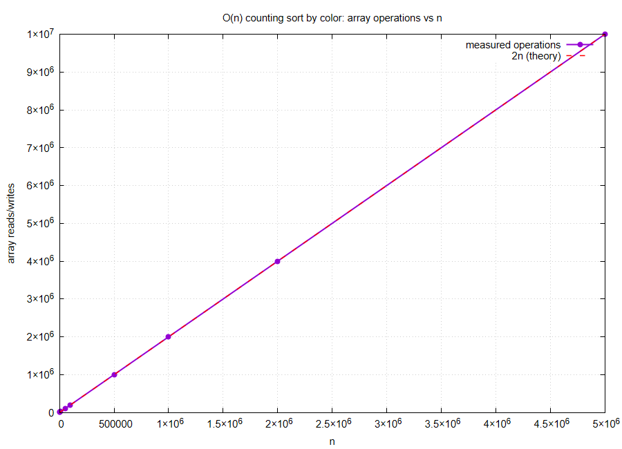
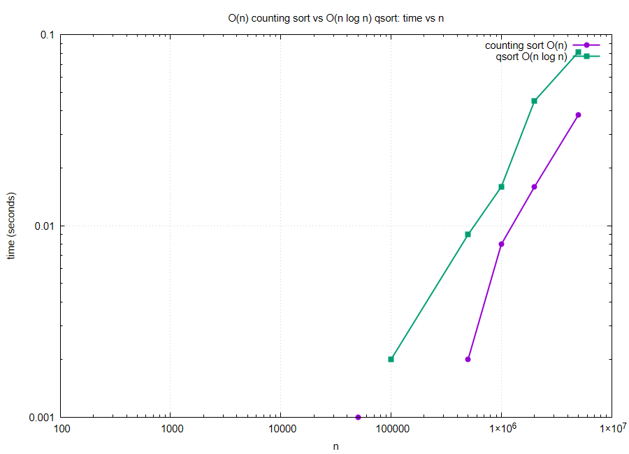

## Sorting (Number, Color) Pairs by Color in O(n)

### The Problem
We're given n pairs `(number, color)`, already sorted by `number`, where `color` is one of three values: RED, BLUE, or YELLOW. The goal is to reorder the pairs so that all REDs come before all BLUEs come before all YELLOWs, **while the numbers within each color group stay sorted** — all in O(n) time.

### How the Code Works
The project is a single self-contained component:
1. **C Implementation (`q1.c`)**: Implements the O(n) stable counting sort described below, keyed on the 3-valued `color` field. It generates random `(number, color)` test inputs (numbers 0..n-1, already sorted; colors assigned uniformly at random) across sizes from 1,000 up to 5,000,000, counts every array read/write the algorithm performs, times it, and times a generic `qsort`-by-color baseline for comparison. All of this is written directly into a self-contained GNUPLOT script, `plot.gnu` — the data lives inline inside the script itself, so there's no separate `.csv`/`.dat` file and no Python dependency.

### Maths Behind This
Since `color` only takes 3 possible values, this is a textbook fit for **counting sort** with k = 3 buckets, which runs in O(n + k) = O(n) since k is a fixed constant, independent of n.

* **Pass 1 — count:** scan the n input pairs once, tallying how many are RED, BLUE, and YELLOW. **n operations.**
* **Compute bucket offsets:** `redPos = 0`, `bluePos = redPos + countRed`, `yellowPos = bluePos + countBlue`. **O(1).**
* **Pass 2 — place:** scan the n input pairs again, *in their original order*, writing each into its color bucket's next open slot and advancing that bucket's pointer. **n operations.**

**Recurrence / operation count:** T(n) = n (count pass) + n (place pass) + O(1) = **2n + O(1) = Θ(n)**.

#### Why the numbers stay sorted within each color (the stability argument)
Pass 2 visits elements in their *original* index order, i = 0 .. n-1. For any two same-colored elements at original positions i < j, element i is written into their shared bucket **before** element j, since bucket pointers only ever advance. Because the input is already sorted by number, i < j implies `A[i].number ≤ A[j].number`. So the order elements are *encountered* in Pass 2 — which becomes their order in the output — already matches numeric order within each color group. This is exactly the stability property that makes counting sort work here: no comparisons between numbers are ever needed, because the input's existing sortedness plus in-order processing does the work for free.

### Complexity Overview
* **Time Complexity:** Θ(n) — two linear passes, no comparisons between elements, no dependence on the numeric range.
* **Space Complexity:** Θ(n) for the output array (or Θ(1) auxiliary if done truly in-place via a 3-way Dutch-flag-style partition, though that variant is trickier to keep stable).
* **Compared to a generic comparison sort:** any comparison-based sort (like `qsort`) is bounded below by Ω(n log n). Restricting to just 3 key values is exactly what lets us beat that bound.

### Observation and Output
Running the benchmark confirms the theory precisely rather than just approximately:

| n | operations (measured) | theoretical 2n |
|---|---|---|
| 1,000 | 2,000 | 2,000 |
| 100,000 | 200,000 | 200,000 |
| 5,000,000 | 10,000,000 | 10,000,000 |

The operation count is **exactly** `2n` at every single size tested — not just asymptotically proportional to n, but matching the derived formula exactly, since the algorithm truly does nothing but two linear passes with no extra bookkeeping that scales with n.



The timing comparison against `qsort` (a generic O(n log n) comparison sort) shows the expected growing gap as n increases — counting sort pulls further ahead at scale, exactly as the Θ(n) vs Θ(n log n) gap predicts:



As seen in the plots, the measured operation count sits exactly on the `2n` reference line (`ops.png`), and the counting-sort time curve stays consistently below the `qsort` curve, with the gap widening as n grows (`time.png`) — direct empirical confirmation that restricting to a constant-size key alphabet (3 colors) turns an O(n log n) problem into an O(n) one.

#### How to Compile and Run

You can compile the C benchmark, run it, and generate both plots with:

```bash
gcc -O2 -o q1 q1.c && ./q1 && gnuplot plot.gnu
```

This produces `ops.png` and `time.png` in the same directory.
